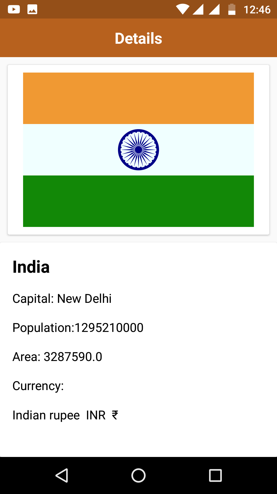

# CountryInfo---Dagger2
Dagger2, Retrofit 2, Webservice, Svg Image Loading

Libraries 

    //Dagger
    compile 'com.google.dagger:dagger:2.11'
    annotationProcessor 'com.google.dagger:dagger-compiler:2.11'

    //Retrofit
    compile 'com.squareup.retrofit2:retrofit:2.0.2'

    //OkHttp
    compile 'com.squareup.okhttp3:okhttp:3.2.0'
    compile 'com.squareup.okio:okio:1.7.0'

    //Gson
    compile 'com.google.code.gson:gson:2.6.2'
    compile 'com.squareup.retrofit2:converter-gson:2.0.1'
    implementation 'com.android.support:recyclerview-v7:26.1.0'
    compile 'com.android.support:cardview-v7:26.1.0'

    //Fresco
    compile 'com.facebook.fresco:fresco:1.5.0'
    
     // Glide
    compile 'com.github.bumptech.glide:glide:4.3.0'
    annotationProcessor 'com.github.bumptech.glide:compiler:4.3.0'
    
    // Svg compatibilty with thesupport of Glide
    compile 'com.caverock:androidsvg:1.2.1'

